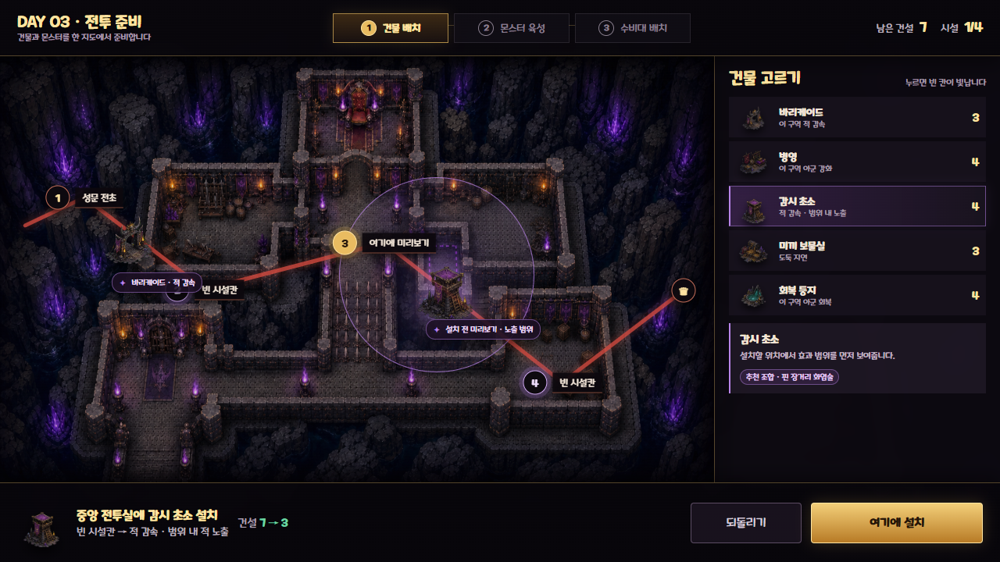
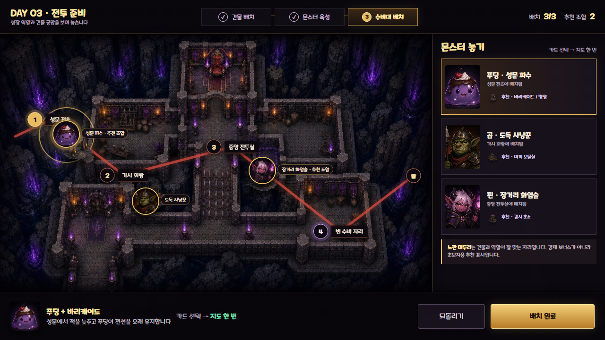
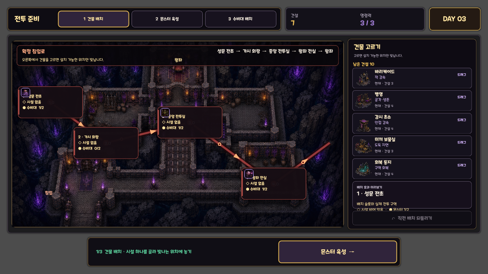

# V20 핵심 준비 UI 예시 이미지

이 폴더는 GitHub에서 화면 방향을 바로 확인하기 위한 리뷰 자료다. 게임 runtime에 읽히는 자산이 아니며 제품 브랜치에 병합하지 않는다.

기준 소스 커밋: `ce1b68c`

## 1. 건물 배치 디자인 예시

- 기존 연결형 마왕성 지도와 시설 5종을 유지한다.
- 시설 선택, 설치 가능 위치, 효과 범위와 설치 행동만 크게 보여준다.

## 2. 몬스터 육성 디자인 예시

- 푸딩·곱·핀 중 한 명에게 집중하고 실제 특화 두 갈래를 비교한다.
- 이미지의 `오늘 훈련 0/2`, 비용과 훈련 수치는 화면 구성용 예시다.
- 현재 구현 범위는 특화 선택, 레벨·EXP·유대 표시와 저장이며 일일 훈련 기능은 포함하지 않는다.

## 3. 수비대 배치 디자인 예시

- 건물 배치와 같은 지도·좌표를 유지한다.
- 캐릭터 역할과 추천 건물의 관계를 지도 위에서 바로 확인한다.

## 4. 현재 실제 구현 화면

- `ce1b68c` 구현을 Windows OpenGL `1280×720`에서 실행한 실제 화면이다.
- 기존 v3 시설 그림을 임시 연결한 상태이며 정식 시설 20장은 아직 제작하지 않았다.

## 파일 성격

| 파일 | 성격 | 게임에서 직접 사용 |
|---|---|---|
| `01_facility_design.png` | 최종 구조 디자인 예시 | 아니요 |
| `02_growth_design.png` | 최종 구조 디자인 예시 | 아니요 |
| `03_guard_placement_design.png` | 최종 구조 디자인 예시 | 아니요 |
| `04_current_facility_implementation.png` | 실제 실행 확인 캡처 | 아니요 |
